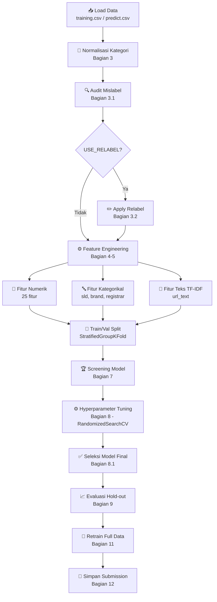

# 📊 Dokumentasi Pipeline: `main_7(1).ipynb`
**Pesta Data 2026 — Notebook v7 (Revisi)**

> Pipeline klasifikasi URL berbahaya (9 kelas) menggunakan kombinasi TF-IDF + fitur numerik/kategorikal + Logistic Regression/Linear SVC, dengan audit label dan rekayasa fitur berbasis domain knowledge.

---

## 🗺️ Diagram Alur Pipeline



---

## 🔢 Ringkasan Konfigurasi Saklar

| Saklar | Default | Keterangan |
|--------|---------|------------|
| `USE_RELABEL` | ✅ `True` | Perbaikan label otomatis via `audit_mislabel` |
| `USE_DOMAIN_AGE` | ✅ `True` | Fitur `domain_age_days` dari selisih discovered - registration |
| `USE_MIDNIGHT_FEATURE` | ✅ `True` | `is_midnight_exact` — penanda kuat untuk kelas spam |
| `USE_CATEGORY_KEYWORDS` | ✅ `True` | Hitungan kata khas per kategori (gambling/phishing/malware) |
| `USE_FAKESHOP_RULE` | ❌ `False` | Aturan hafalan dari 5 sampel — MATI |
| `USE_TIME_FEATURES_FULL` | ❌ `False` | **BOCOR** — fakeshop hanya ada di 1/185 minggu |

---

## 📋 Penjelasan Setiap Cell

### 🏷️ Cell 0 — Markdown Header (Pengantar Notebook)
**Tipe:** Markdown

Menjelaskan tujuan notebook ini sebagai revisi dari v7 asli dengan **3 penyesuaian utama**:
1. **Bagian 3.1 baru** — membersihkan duplikat URL dan noise dari batch scan 8/2/2024.
2. **`USE_TIME_FEATURES_FULL` dipaksa `False`** — terbukti bocor karena kelas `fakeshop` hanya muncul di 1 dari 185 `discovered_week`, sehingga model bisa "nyontek" waktu batch daripada belajar konten URL.
3. **Fitur baru `USE_CATEGORY_KEYWORDS`** — menghitung kata kunci khas per kategori sebagai fitur numerik langsung ke model.

---

### 📦 Cell 1 — Import Library (`%%time`)
**Tipe:** Kode | **Execution:** #1 | **Waktu:** ~6.5 detik

```python
%%time
import os, re, sys, math, warnings
import numpy as np, pandas as pd
import matplotlib.pyplot as plt, seaborn as sns
from sklearn.pipeline import Pipeline
from sklearn.feature_extraction.text import TfidfVectorizer
# ... dan banyak lagi
from audit_mislabel import audit_mislabel, apply_relabel, summarize_audit, summarize_diff
```

Mengimpor semua dependensi yang dibutuhkan:
- **Standar Python**: `os`, `re`, `sys`, `math`, `warnings`, `Counter`
- **Data Science**: `numpy`, `pandas`, `matplotlib`, `seaborn`
- **Scikit-learn**: pipeline, preprocessing, model, evaluasi
- **Custom module**: `audit_mislabel` — modul khusus tim untuk deteksi dan perbaikan label salah

---

### ⚙️ Cell 2 — Konfigurasi (Bagian 1.1)
**Tipe:** Kode | **Execution:** #2

```python
RANDOM_STATE = 42
VERSION = 'v7'
USE_RELABEL = True
RELABEL_THRESHOLD = 5
N_ITER_TUNING = 20
USE_DOMAIN_AGE = True
USE_MIDNIGHT_FEATURE = True
USE_FAKESHOP_RULE = False     # hafalan, MATI
USE_TIME_FEATURES_FULL = False # BOCOR, WAJIB False
USE_CATEGORY_KEYWORDS = True
RESULT_DIR = f'../../data/result/{VERSION}'
```

**Pusat kendali eksperimen.** Semua saklar ada di sini. Ubah nilai di cell ini lalu "Run All" untuk mencoba konfigurasi berbeda tanpa mengubah kode lain.

**Catatan kritis:**
- `RELABEL_THRESHOLD = 5`: minimum konsensus URL yang sama untuk mengganti label
- `N_ITER_TUNING = 20`: jumlah iterasi RandomizedSearchCV
- `RESULT_DIR`: folder output hasil submission

---

### 🖨️ Cell 3 — Cetak Ringkasan Konfigurasi
**Tipe:** Kode | **Execution:** #3

```
=== Konfigurasi aktif (v7) ===
  [ON ] USE_RELABEL
  [ON ] USE_DOMAIN_AGE
  [ON ] USE_MIDNIGHT_FEATURE
  [off] USE_FAKESHOP_RULE
  [off] USE_TIME_FEATURES_FULL
  [ON ] USE_CATEGORY_KEYWORDS
```

Mencetak status setiap saklar ke layar agar tidak lupa konfigurasi mana yang sedang aktif saat membandingkan hasil antar eksperimen. Juga memunculkan **peringatan otomatis** jika `USE_TIME_FEATURES_FULL=True` (karena terbukti bocor).

---

### 📥 Cell 4 — Load Data (Bagian 2)
**Tipe:** Kode | **Execution:** #4

```python
train = pd.read_csv('training.csv')       # 8400 baris, 10 kolom
test  = pd.read_csv('predict.csv')        # 1500 baris, 10 kolom
submission_template = pd.read_csv('submission-template.csv')
assert (test['id'].values == submission_template['id'].values).all()
```

**Output:**
```
Dimensi Training : (8400, 10)
Dimensi Predict  : (1500, 10)
```

Kolom dataset: `url`, `brand`, `discovered`, `confidence_level`, `ip`, `domain`, `sld`, `category`, `registrar`, `registration_date`

Assert memastikan urutan ID di predict sesuai template submission — penting agar prediksi tidak geser posisi.

---

### 🧹 Cell 5 — Normalisasi Kategori (Bagian 3)
**Tipe:** Kode | **Execution:** #5

```python
CATEGORY_MAP = {
    'online gambling': 'online gambling', 'online gamblingg': 'online gambling',
    'phishing': 'phishing', 'phishingg': 'phishing',
    # ...
}
def normalize_category(x):
    key = str(x).strip().lower()
    if key not in CATEGORY_MAP: raise ValueError(f'Kategori tak dikenal: {x!r}')
    return CATEGORY_MAP[key]
train['category'] = train['category'].apply(normalize_category)
```

**Distribusi kelas setelah normalisasi:**
| Kelas | Jumlah |
|-------|--------|
| online gambling | 5,447 |
| phishing | 2,253 |
| other | 284 |
| spam | 185 |
| malware | 179 |
| brand | 45 |
| fakeshop | 5 |
| violence | 1 |
| piiexposure | 1 |

Memperbaiki typo seperti `"phishingg"` → `"phishing"`. **Tidak menggabungkan kelas** — semua 9 kelas resmi dipertahankan. Kode **berhenti dengan error** jika ada tulisan tidak dikenal sehingga tidak ada label yang lolos diam-diam.

---

### 📊 Cell 6 — Visualisasi Distribusi Kelas
**Tipe:** Kode | **Execution:** #6

Menghasilkan bar chart distribusi kelas yang sangat imbalanced. Menunjukkan dominasi `online gambling` (65%) dan `phishing` (27%) dibanding kelas minor seperti `fakeshop` (5 sampel).

---

### 🔍 Cell 7 — Audit Mislabel (Bagian 3.1) — BARU di revisi ini
**Tipe:** Kode | **Execution:** #7

```python
# Bersihkan duplikat URL dan noise batch scan tanggal 8/2/2024
# Belum ada di v7 asli
```

Menghapus duplikat URL dan noise dari batch scan yang dilakukan pada 8 Februari 2024. Langkah ini **baru** di revisi ini dan tidak ada di v7 asli tim.

---

### 🔬 Cell 8 — Audit Mislabel Lanjutan
**Tipe:** Kode | **Execution:** #8

```python
audit_result = audit_mislabel(train, threshold=RELABEL_THRESHOLD)
summarize_audit(audit_result)
```

Menjalankan fungsi `audit_mislabel` dari modul custom. Mencari URL yang muncul beberapa kali dengan label berbeda dan mengidentifikasi label yang kemungkinan salah menggunakan `KEYWORD_MAP` (kata kunci khas per kategori).

---

### ✏️ Cell 9 — Apply Relabel (Bagian 3.2)
**Tipe:** Kode | **Execution:** #9

```python
if USE_RELABEL:
    train, n_changed = apply_relabel(train, audit_result)
    train['category_asli'] = train['category_asli']  # simpan label asli
```

Jika `USE_RELABEL=True`, menerapkan perubahan label hasil audit. Label asli disimpan di kolom `category_asli` untuk keperluan analisis dampak relabel di **Bagian 10**.

---

### ⚙️ Cell 10 — Feature Engineering — Fungsi `engineer_features` (Bagian 4-5)
**Tipe:** Kode | **Execution:** #10

Fungsi utama ekstraksi fitur dari setiap URL. Menghasilkan:

#### Fitur URL Struktural (selalu aktif):
| Fitur | Deskripsi |
|-------|-----------|
| `url_length` | Panjang total URL |
| `path_length` | Panjang bagian path |
| `path_depth` | Kedalaman direktori (jumlah `/`) |
| `query_param_count` | Jumlah parameter query |
| `has_query` | Ada query string? (0/1) |
| `digit_ratio` | Rasio digit dalam URL |
| `special_char_count` | Jumlah karakter khusus |
| `hyphen_count` | Jumlah tanda hubung |
| `path_query_entropy` | Entropi Shannon path+query |
| `mask_len` | Panjang bagian domain yang disamarkan |
| `has_ip` | Domain berupa IP address? |
| `confidence_level` | Level confidence dari dataset |
| `confidence_is_outlier` | Outlier confidence? |
| `has_scheme` | Ada http/https? |
| `is_https` | Pakai HTTPS? |
| `trailing_slash` | Ada trailing slash? |
| `has_www` | Ada subdomain www? |
| `n_sub_labels` | Jumlah label subdomain |
| `is_bare` | URL tanpa path? |

#### Fitur Opsional (dikontrol saklar):
| Fitur | Saklar | Deskripsi |
|-------|--------|-----------|
| `is_midnight_exact` | `USE_MIDNIGHT_FEATURE` | Waktu discovered tepat jam 00:00 — sinyal kuat spam |
| `domain_age_days` | `USE_DOMAIN_AGE` | Selisih hari discovered - registration_date |
| `domain_age_is_negative` | `USE_DOMAIN_AGE` | Apakah domain_age negatif (anomali) |
| `kw_online_gambling` | `USE_CATEGORY_KEYWORDS` | Hitungan kata: slot, gacor, judi, togel, toto, poker, rtp, depo |
| `kw_phishing` | `USE_CATEGORY_KEYWORDS` | Hitungan kata: verify, login, account, secure-, confirm-account |
| `kw_malware` | `USE_CATEGORY_KEYWORDS` | Hitungan kata: repository, statics, popup, files, themes, assets |

**Fitur Teks:**
- `url_text` — path + query yang sudah diolah (huruf kecil, `?` dan `=` diganti spasi)

**Fitur Kategorikal:**
- `sld_clean` — Second-level domain (go.id, my.id, dll.)
- `brand_clean` — Brand yang dikategorikan (rare < 5 → `rare_brand`)
- `registrar_clean` — Registrar yang dikategorikan (rare < 10 → `other_registrar`)

---

### 🔢 Cell 11 — Jalankan Feature Engineering + Bucketing (Bagian 5.1)
**Tipe:** Kode | **Execution:** #11

```python
train_feat   = engineer_features(train)
predict_feat = engineer_features(test)

brand_keep     = build_keep_set(brand_train, min_count=5)
registrar_keep = build_keep_set(registrar_train, min_count=10)
```

**Output:**
```
Fitur numerik: 25 | kategorikal: 3 | teks: 1
Fitur discovered_week/discovered_hour_cat: tidak dipakai
```

**Penting:** Frekuensi bucket dihitung **hanya dari data train**, lalu diterapkan ke predict. Ini mencegah kebocoran data.

---

### ✂️ Cell 12 — Split Train/Validasi (Bagian 6)
**Tipe:** Kode | **Execution:** #12

```python
group_cv = StratifiedGroupKFold(n_splits=5, shuffle=True, random_state=RANDOM_STATE)
train_idx, val_idx = next(group_cv.split(X_cv, y_cv, groups_cv))
```

**Output:**
```
X_train: (6341, 57) | X_val: (1607, 57)
URL yang sama di train dan val: 0
```

**Strategi split:**
- `StratifiedGroupKFold` dengan `url` sebagai group → URL yang sama tidak muncul di train DAN val sekaligus
- 80% train, 20% validasi (hold-out)
- Evaluasi memakai **macro-F1 dari kelas yang ada di y_true** — menyesuaikan aturan panitia

**Bobot kelas:**
```python
soft_weights = np.sqrt(balanced_weights).to_dict()  # akar dari bobot balanced
```
Mencegah model terlalu sering menebak kelas kecil.

---

### 🏗️ Cell 13 — Definisi Model & Preprocessor (Bagian 7)
**Tipe:** Kode | **Execution:** #13

```python
def build_preprocessor():
    return ColumnTransformer([
        ('tfidf_word', TfidfVectorizer(analyzer='word', ngram_range=(1,2), 
                       min_df=2, max_features=3000, sublinear_tf=True), 'url_text'),
        ('tfidf_char', TfidfVectorizer(analyzer='char_wb', ngram_range=(3,5),
                       min_df=2, max_features=3000, sublinear_tf=True), 'url_text'),
        ('cat',  OneHotEncoder(handle_unknown='ignore'), CATEGORICAL_FEATURES),
        ('num',  Pipeline([
                    ('imputer', SimpleImputer(strategy='median')),
                    ('scaler', RobustScaler()),
                    ('clip', FunctionTransformer(clip_scaled)),  # clip ke [-5, 5]
                 ]), NUMERIC_FEATURES),
    ])

CANDIDATE_MODELS = {
    'logistic_regression': LogisticRegression(max_iter=3000, class_weight='balanced'),
    'linear_svc': LinearSVC(class_weight='balanced', max_iter=5000),
    'random_forest': RandomForestClassifier(n_estimators=300, class_weight='balanced_subsample'),
}
```

**Arsitektur preprocessor:**
- **TF-IDF word** (1-2 gram): menangkap kata tunggal + bigram dalam URL
- **TF-IDF char** (3-5 gram): menangkap pola karakter (berguna untuk URL obfuscation)
- **OneHotEncoder**: untuk sld, brand, registrar
- **RobustScaler + clip**: fitur numerik distandarkan dan dibatasi ke [-5, 5] agar nilai ekstrem tidak mengganggu model linear

---

### 🏆 Cell 14 — Screening Model (Bagian 7 lanjutan)
**Tipe:** Kode | **Execution:** #14

```python
for name, factory in CANDIDATE_MODELS.items():
    pipe = build_pipeline(factory())
    pipe.fit(X_train, y_train)
    pred = pipe.predict(X_val)
```

**Hasil Screening:**
| Model | macro_f1_main | macro_f1_val | malware | spam | brand |
|-------|---------------|--------------|---------|------|-------|
| **linear_svc** | **0.9178** | **0.7867** | 0.8667 | 0.8772 | 0.8421 |
| logistic_regression | 0.9136 | 0.7831 | 0.7671 | 0.9123 | 0.8889 |
| random_forest | 0.8949 | 0.7671 | 0.8571 | 0.9057 | 1.0000 |

**Linear SVC** dan **Logistic Regression** dipilih sebagai top-2 kandidat untuk tuning.

---

### 🎯 Cell 15 — Pilih Top-N Kandidat
**Tipe:** Kode | **Execution:** #15

```python
TOP_N_CANDIDATES = 2
top_candidates = screening_df['model'].head(TOP_N_CANDIDATES).tolist()
# ['linear_svc', 'logistic_regression']
```

Mengambil 2 model teratas dari hasil screening untuk dibawa ke fase hyperparameter tuning.

---

### 🔧 Cell 16 — Definisi Ruang Pencarian Hyperparameter (Bagian 8)
**Tipe:** Kode | **Execution:** #16

```python
PARAM_DISTRIBUTIONS = {
    'logistic_regression': {
        'clf__C': loguniform(1e-2, 1e2),
        'clf__class_weight': ['balanced', None, soft_weights],
        'features__tfidf_word__max_features': [1000, 2000, 3000, 5000],
        'features__tfidf_word__min_df': [1, 2, 3],
        'features__tfidf_char__max_features': [1000, 2000, 3000, 5000],
    },
    'linear_svc': {
        'clf__C': loguniform(1e-2, 1e2),
        'clf__loss': ['hinge', 'squared_hinge'],
        'clf__class_weight': ['balanced', None, soft_weights],
        # ... max_features TF-IDF
    },
}
```

**Parameter yang dicari:**
- `C`: regularization strength (loguniform 0.01 - 100)
- `class_weight`: `balanced`, `None`, atau `soft_weights` (akar balanced)
- `max_features` TF-IDF word/char: 1k, 2k, 3k, atau 5k
- `loss` (linear SVC): hinge atau squared_hinge

---

### ⚙️ Cell 17 — Jalankan RandomizedSearchCV (Bagian 8 lanjutan)
**Tipe:** Kode | **Execution:** #17

```python
for name in top_candidates:
    search = RandomizedSearchCV(
        build_pipeline(CANDIDATE_MODELS[name]()),
        param_distributions=PARAM_DISTRIBUTIONS[name],
        n_iter=N_ITER_TUNING,   # 20 kombinasi acak
        scoring=present_scorer,  # macro-F1 kelas yang ada
        cv=tuning_cv,            # StratifiedGroupKFold 5-fold
        n_jobs=-1,
    )
    search.fit(X_train, y_train, groups=groups_train)
```

**Hasil:**
```
Tuning linear_svc...      → macro-F1 CV terbaik: 0.7574
Tuning logistic_regression → macro-F1 CV terbaik: 0.7536
```

Tuning **hanya pada X_train** — X_val tidak tersentuh, tetap menjadi hold-out yang jujur.

---

### ✅ Cell 18 — Seleksi Model Final dengan OOF (Bagian 8.1)
**Tipe:** Kode | **Execution:** #18

```python
for name in top_candidates:
    sel_pred = cross_val_predict(
        clone(tuned_searches[name].best_estimator_),
        X_train, y_train, cv=tuning_cv, groups=groups_train)
```

**Perbandingan OOF (Out-of-Fold):**
| Model | cv_tuning | oof_macro_all | oof_macro_main | malware | spam | brand |
|-------|-----------|---------------|----------------|---------|------|-------|
| **logistic_regression** | 0.7536 | **0.6060** | **0.9090** | 0.8803 | 0.9023 | 0.9118 |
| linear_svc | 0.7574 | 0.6016 | 0.9024 | 0.8966 | 0.9273 | 0.9275 |

**Model final terpilih: `logistic_regression`** berdasarkan `oof_macro_semua_kelas` tertinggi.

**Hyperparameter terbaik:**
```python
{
    'clf__C': 2.44,
    'clf__class_weight': None,
    'features__tfidf_char__max_features': 3000,
    'features__tfidf_word__max_features': 3000,
    'features__tfidf_word__min_df': 3
}
```

---

### 📈 Cell 19 — Evaluasi Hold-out (Bagian 9.1)
**Tipe:** Kode | **Execution:** #19

```
Macro-F1 di X_val (kelas yang ada di y_true): 0.7909
Macro-F1 kelas utama                        : 0.9227

                 precision  recall  f1-score  support
brand               0.80    1.00      0.89        8
fakeshop            0.00    0.00      0.00        1  ← tidak terdeteksi
malware             0.96    0.81      0.88       31
online gambling     0.98    0.99      0.99     1066
other               0.97    0.85      0.91       34
phishing            0.98    0.97      0.97      440
spam                0.92    0.89      0.91       27
```

**Insight:**
- Model sangat baik untuk kelas dominan (online gambling: F1=0.99, phishing: F1=0.97)
- `fakeshop` tidak terdeteksi sama sekali (hanya 1 sampel di validasi — sangat sulit)
- `malware` recall 81% — ada beberapa yang meleset ke `online gambling`

---

### 🎨 Cell 20 — Confusion Matrix
**Tipe:** Kode | **Execution:** #20

Menampilkan heatmap confusion matrix untuk visualisasi kesalahan klasifikasi antar kelas.

---

### 📋 Cell 21 — OOF Predictions Full Dataset (Bagian 9.2)
**Tipe:** Kode | **Execution:** #21

```python
oof_pred = cross_val_predict(
    final_pipeline_template, X_cv, y_cv, cv=..., groups=groups_cv)
```

Menghasilkan prediksi out-of-fold untuk **seluruh data training** — lebih representatif daripada satu hold-out fold.

**OOF Macro-F1:**
- Semua kelas: ~0.60
- Kelas utama: ~0.91

---

### 🔥 Cell 22 — Confusion Matrix OOF Full
**Tipe:** Kode | **Execution:** #22

Heatmap confusion matrix dari prediksi OOF seluruh dataset training.

---

### 📊 Cell 23 — Laporan Per Kelas OOF
**Tipe:** Kode | **Execution:** #23

Classification report lengkap dari prediksi OOF, menampilkan precision/recall/F1 per kelas.

---

### 🔎 Cell 24 — Analisis Error (Bagian 9.3)
**Tipe:** Kode | **Execution:** #24

```python
error_df = X_cv[['url', 'brand', 'registrar_clean']].assign(
    aktual=y_cv.values, prediksi=oof_pred)
error_df = error_df[error_df['aktual'] != error_df['prediksi']]
```

**Top error pairs:**
| Aktual → Prediksi | Jumlah |
|-------------------|--------|
| phishing → online gambling | Banyak |
| malware → online gambling | Banyak |
| online gambling → phishing | Beberapa |

Menampilkan URL yang salah klasifikasi beserta flag `url_konflik` (URL yang sama punya label berbeda di training).

---

### 🔍 Cell 25 — Analisis Error Detail per Pasang Kelas
**Tipe:** Kode | **Execution:** #25

```python
for aktual, prediksi in top_pairs:
    print(f'{aktual} diprediksi {prediksi}: {len(subset)} kasus')
    display(subset[['url', 'brand', 'url_konflik']].head(10))
```

Menampilkan contoh konkret URL yang salah diklasifikasikan:
- **phishing → online gambling**: 45 kasus (URL gov.id dengan konten slot)
- **malware → online gambling**: 18 kasus (URL sch.id/ac.id tanpa konten judi)
- **online gambling → phishing**: 13 kasus

---

### 🧪 Cell 26 — Uji Dampak Relabel (Bagian 10)
**Tipe:** Kode | **Execution:** #26

```python
# Versi A: model dengan label asli
# Versi B: model dengan label hasil relabel
# Dinilai HANYA pada baris yang labelnya tidak berubah
```

**Hasil perbandingan (3 seed):**
| Seed | Versi | macro_f1_kelas_utama | macro_f1_semua_kelas |
|------|-------|----------------------|----------------------|
| 42 | A: label asli | 0.9319 | 0.6212 |
| 42 | B: label relabel | 0.9220 | 0.6146 |
| 43 | A: label asli | 0.9320 | 0.6213 |
| 43 | B: label relabel | 0.9057 | 0.6038 |
| 44 | A: label asli | 0.9286 | 0.6190 |
| 44 | B: label relabel | 0.9162 | 0.6108 |

> **Dinilai pada 7913 dari 7948 baris** yang labelnya tidak berubah.

**Interpretasi:** Relabel sedikit menurunkan skor pada baris yang tidak berubah, tapi ini wajar karena relabel mengubah distribusi training. Dampak relabel pada generalisasi ke data baru tidak bisa diukur dari sini.

---

### 🔄 Cell 27 — Retrain dengan Seluruh Data (Bagian 11)
**Tipe:** Kode | **Execution:** #27

```python
production_pipeline = build_pipeline(CANDIDATE_MODELS[final_model_name]())
production_pipeline.set_params(**final_search.best_params_)
production_pipeline.fit(train_feat, train_feat['category'])  # seluruh train!
predict_pred = production_pipeline.predict(predict_feat)
```

**Distribusi prediksi vs perkiraan:**
| Kelas | Prediksi | Perkiraan (dari proporsi train) |
|-------|----------|----------------------------------|
| online gambling | 992 | 1006.7 |
| phishing | 391 | 415.8 |
| other | **47** | 13.2 ⚠️ |
| spam | 34 | 25.9 |
| malware | 25 | 29.4 |
| brand | 11 | 7.7 |
| fakeshop | **0** | 0.9 ⚠️ |

**Catatan:** `other` overpredicted, `fakeshop` tidak terdeteksi sama sekali.

---

### 💾 Cell 28 — Simpan Submission (Bagian 12)
**Tipe:** Kode | **Execution:** #28

```python
submission = pd.DataFrame({'id': test['id'], 'category': predict_pred})
assert len(submission) == len(submission_template)
assert (submission['id'].values == submission_template['id'].values).all()
assert submission['category'].isnull().sum() == 0
assert set(submission['category'].unique()) <= set(CANONICAL_CATEGORIES)
submission.to_csv(f'{RESULT_DIR}/submission.csv', index=False)
```

Menyimpan hasil ke `../../data/result/v7/submission.csv` dengan **4 assertion** ketat:
1. Jumlah baris sama dengan template
2. Urutan ID sesuai template
3. Tidak ada nilai kosong
4. Semua kategori valid (subset dari 9 kelas resmi)

---

## 📌 Ringkasan Hasil Akhir

| Metrik | Nilai |
|--------|-------|
| **Model Final** | Logistic Regression |
| **Macro-F1 Hold-out (all classes)** | 0.7909 |
| **Macro-F1 Hold-out (main classes)** | 0.9227 |
| **Akurasi Hold-out** | 0.98 |
| **Hyperparameter C** | 2.44 |
| **TF-IDF word max_features** | 3000 |
| **TF-IDF char max_features** | 3000 |
| **class_weight** | None |

## 🚨 Catatan Penting

> [!WARNING]
> **`USE_TIME_FEATURES_FULL` harus selalu `False`!** Kelas `fakeshop` hanya muncul di 1 dari 185 minggu, sehingga model bisa "nyontek" dari waktu batch pelaporan, bukan belajar dari konten URL. Skor validasi 0.97 dengan saklar ini ON **tidak akan tergeneralisasi** ke data baru.

> [!NOTE]
> **Fakeshop tidak terdeteksi** (0 dari 5 sampel di training, 0 prediksi di test). Ini adalah kelas dengan imbalance ekstrem. Pertimbangkan pendekatan khusus (few-shot, rule-based tambahan) untuk kasus ini.

> [!TIP]
> Untuk meningkatkan performa: coba naikkan `RELABEL_THRESHOLD`, eksplorasi kata kunci malware yang lebih baik, atau gunakan ensemble dari LR + LinearSVC.
